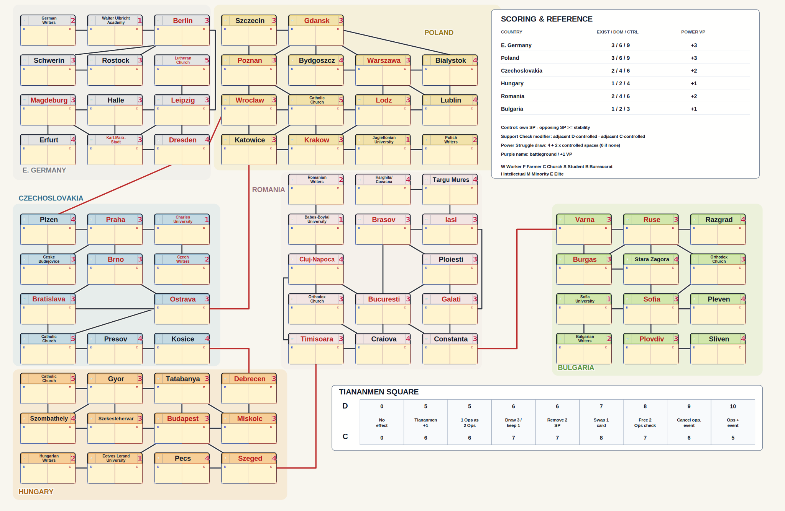

# 1989 Compact Map

一张为 GMT Games 桌游 **《1989: Dawn of Freedom》** 制作的非官方电子化紧凑地图，同时提供可直接打印的 SVG 版本。

电子版将原版地图的 75 个地区和连接关系重新排布到更紧凑的网格中，适合在一块屏幕上进行游戏。它保留了游戏所需的影响力、稳定度、控制判定、国家计分和天安门广场等信息，但不替代实体游戏、规则书或卡牌。

## 打印版地图

[](assets/1989_print_map.svg)

点击地图可打开独立 SVG，适合浏览器打印或导入矢量编辑软件。打印时建议使用横向页面，并按纸张大小缩放。

## 电子版功能

- 点击节点左右两侧增减 Democrat / Communist Support Points；达到控制条件时自动切换显示样式。
- 自动计算六个国家的 Presence、Domination、Control 和关键地区分数。
- 提供 VP、Turn、Power Struggle、Tiananmen Square 和掷骰追踪工具。
- 支持英文与中文界面，包括全部地图节点名称。
- 支持手动保存、读取、重置，以及浏览器本地自动保存。
- 鼠标悬停节点时显示当前 Support Check modifier。

## 运行电子版

浏览器出于安全限制通常不允许通过 `file://` 读取相邻的 SVG 和 TSV 文件，因此建议在仓库目录启动一个本地服务器：

```bash
python3 -m http.server 8000
```

然后打开：

```text
http://127.0.0.1:8000/1989_compact_map_interactive.html
```

## 基本操作

| 操作 | 结果 |
| --- | --- |
| 节点左键 | 对点击的一方增加 1 SP |
| 节点右键 | 对点击的一方减少 1 SP |
| VP 左键 / 右键 | VP -1 / +1 |
| Turn 左键 / 右键 | 回合 -1 / +1 |
| Tiananmen 左键 / 右键 | 对应一方前进 / 后退 |

控制判定遵循 `己方 SP - 对方 SP >= 稳定度`。节点稳定度是固定值，不会随影响力变化。

## 项目结构

```text
1989_compact_map_interactive.html  电子版地图，包含全部交互逻辑
assets/1989_compact_map.svg         电子版使用的紧凑底图
assets/1989_print_map.svg           无交互控件的打印版地图
data/spaces.tsv                     地区、国家、稳定度与类别
data/edges.tsv                      节点连接关系
data/opening_support.tsv            开局影响力
data/country_scoring.tsv            国家计分参数
```

## 数据与说明

连接关系和地图数据依据游戏程序中的地图定义整理；界面与排版为适应屏幕游玩和打印而重新设计。仓库只保留最终地图运行所需的数据，不包含开发期间的反编译输出、调试页面和临时分析文件。

这是玩家制作的非官方辅助工具，与 GMT Games 及原游戏设计者没有关联。《1989: Dawn of Freedom》的名称及相关游戏内容归各自权利人所有。使用本项目仍需拥有正版游戏，并以官方规则为准。

---

An unofficial compact digital map and printable SVG companion for the **1989: Dawn of Freedom** board game. It is designed to support play on a single screen and does not replace the physical game, cards, or official rules.
